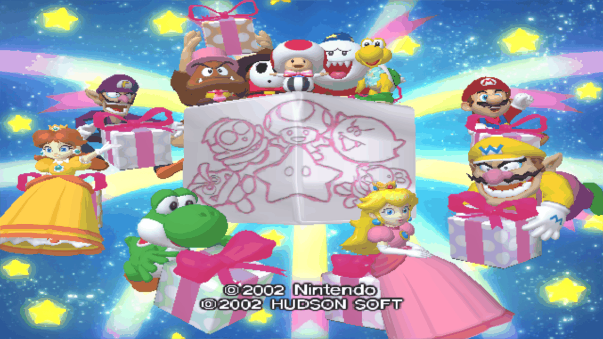
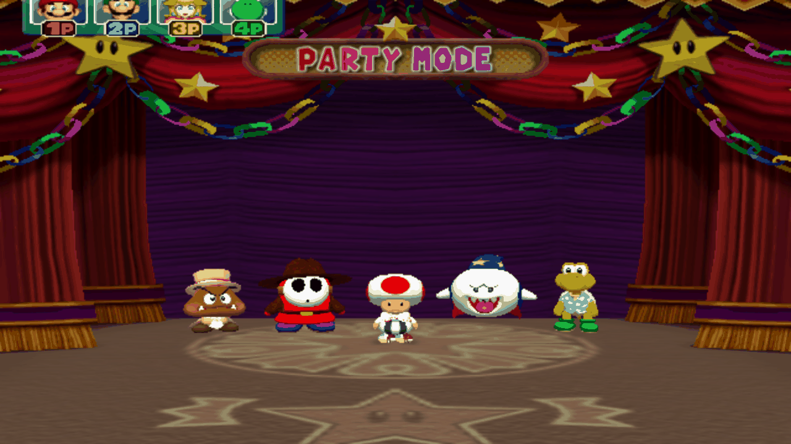
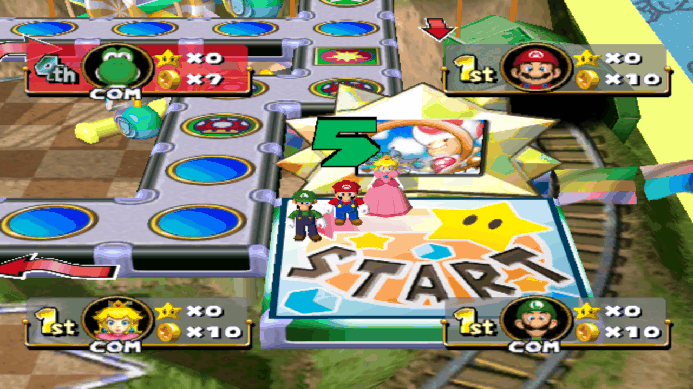
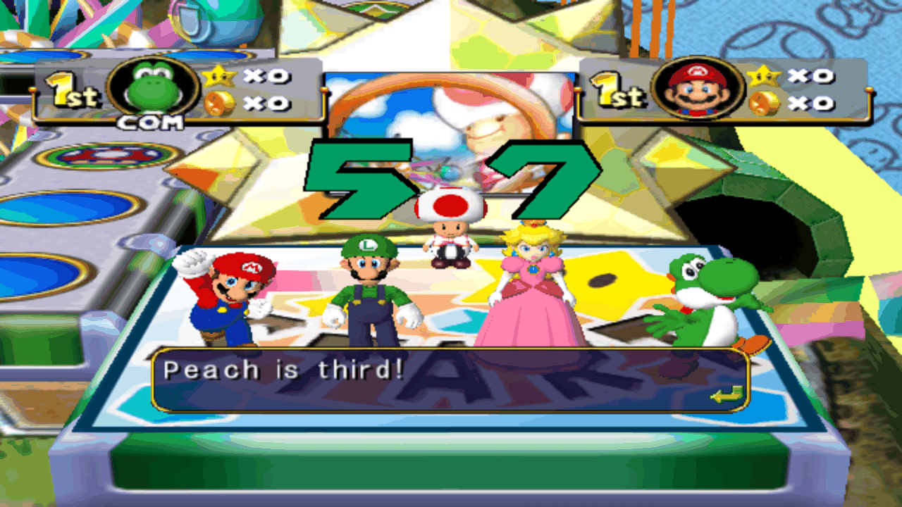
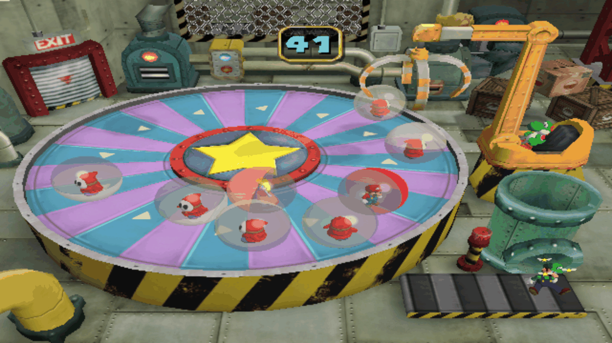

# PartyBoard — Mario Party 4 on NextOS Elite

**Language / Idioma:** [English](#english) · [Português](#português)

---

## English

A native AArch64 port of **Mario Party 4** for **NextOS Elite** on Amlogic
hardware with the **Mali-450 (Utgard) GPU and OpenGL ES 2.0**.

This is a fork of the [PartyBoard](https://github.com/mariopartyrd/partyboard)
PC port, itself built on the Mario Party R&D decompilation. It runs the
reconstructed game code natively — it is **not** a GameCube emulator. The port
is playable end to end: title screen, boards, minigames, four controllers,
music, sound effects, saves, and a clean exit back to the frontend.

> [!WARNING]
> **Target hardware: Mali-450 (Utgard) with OpenGL ES 2.0 only.**
>
> This port was written for, built for and tested on exactly one class of
> hardware: Amlogic devices running NextOS Elite with an ARM **Mali-450 MP**
> (Utgard) GPU on the **fbdev** path, rendering through **OpenGL ES 2.0**.
>
> Nothing here has been tested on any other GPU, driver, kernel, distribution or
> graphics API. The renderer targets ES 2.0 specifically — there is no ES 3.x,
> desktop GL, Vulkan or WebGPU path in this fork. The shipped Mali program-binary
> cache is bound to that exact driver, and the performance tuning assumes a
> Cortex-A53 CPU with a fixed-function Mali-450. Other hardware may build, may
> run, may render incorrectly, or may not start at all — none of it is supported
> or claimed to work.

> [!IMPORTANT]
> This repository contains **no game data whatsoever** — no disc image, ROM,
> audio bank, texture, or any other Nintendo/Hudson asset. `orig/` holds only
> `.gitkeep` placeholders. You must supply your own legally obtained copy of the
> game. See [Game data](#game-data).

### Contents

- [Screenshots](#screenshots)
- [What this fork adds](#what-this-fork-adds)
- [Repository layout](#repository-layout)
- [Release status](#release-status)
- [Architecture](#architecture)
- [Performance work](#performance-work)
- [Controls](#controls)
- [Game data](#game-data)
- [Building](#building)
- [Packaging](#packaging)
- [Source map](#source-map)
- [Credits](#credits)
- [Legal](#legal)

### Screenshots

Captured from the framebuffer on the target hardware — Mali-450 (Utgard),
OpenGL ES 2.0, fbdev, at the panel's native 1280×720.

| | |
|:---:|:---:|
|  |  |
| Boots and renders the title screen | Party Mode — 1P/2P/3P/4P, four controllers |
|  |  |
| A full 3D board, four-player HUD | Dialogs and text, in English |



*A minigame running — transparency, timer HUD, full scene.*

### What this fork adds

Two pieces of engineering carried this port from "boots to a title screen" to a
complete, playable release.

#### 1. Getting Aurora's GLES renderer onto Mali-450

Aurora — the GameCube compatibility layer PartyBoard renders through —
originally targets Dawn/WebGPU, which no Mali of this class can run.

**The GLES / GLES3 backend that replaced it is not our work.** It was written by
**[Brian Degenhardt (`bmdhacks`)](https://github.com/bmdhacks/aurora)** for the
**[Dusklight](https://github.com/TwilitRealm/dusklight)** port — the
reverse-engineered reimplementation of *The Legend of Zelda: Twilight Princess*.
That is where the renderer was cut over from Dawn/WebGPU and where the hard
parts were designed and proven: the GLSL emitter that lowers the GX (TEV)
pipeline to GLES shaders, EFB copy/resolve machinery, persistently mapped
write-combine ring buffers, RmlUi and imgui compositing on the GLES path, the
persistent program-binary disk cache, and the GPU-object leak fixes. Roughly 34
commits of renderer work, on top of Aurora itself by Luke Street. **Mario Party 4
renders at all because that groundwork already existed.**

That backend targets a Mali **G31** — a Bifrost part with OpenGL ES 3.x. The
Mali-450 is Utgard: fixed-function, **ES 2.0 only**, no ES 3.x path available at
any price.

**The OpenGL ES 2.0 backend is ours.** Taking the ES 3.x renderer down to ES 2.0
was 39 files and ~1,700 lines: an ES2 EGL configuration
(`EGL_OPENGL_ES2_BIT` in place of `EGL_OPENGL_ES3_BIT`), a GLSL ES 1.00
(`#version 100`) shader emission path — 342 lines in the GX shader layer alone —
and the ES2-level rework of the GL loader, device and buffer layers, texture-copy
and palette conversion, clears, pad handling, timing and the fbdev present path.

Also ours, on top of that:

- **A dynamic-palette width fix** — palettes were sampled at the wrong width.
- **The GX FIFO drain optimization** that lifted Mario Party 4 off a ~22 fps
  ceiling, together with memoized shader/pipeline state and optimized vertex
  expansion and hashing in the decode-bound draw path.

#### 2. Real audio, without emulating a DSP

MusyX's PC target rendered nothing: `salBuildCommandList` was gated behind
`MUSY_TARGET == DOLPHIN`, and `salAiGetDest` returned `NULL`. Getting sound out
took two independent fixes, in order:

**Endianness.** The decompiled MSM/MusyX code reads big-endian disc data, so on
AArch64 every multi-byte field came back wrong. Byte-swapping had to follow the
data through eight layers — `MSM_HEADER` → `MSM_INFO` → `MSM_STREAM_HEADER` →
`MSM_GRP_INFO` → `MSM_AUXPARAM` → `GROUP_DATA` → the sample and macro
sub-tables — after first fixing `msmSysInit`, which truncated a heap pointer to
32 bits.

**The missing synthesizer.** There simply was no PC-side synth. One was written
for the MusyX PC backend: ADPCM decode, per-voice volume and pan, ADSR
envelopes, and 32 kHz stereo mixing into the AI destination buffer — with the
ARAM sample path restored and `AIRegisterDMACallback` (previously a stub) wired
back into the DMA callback chain.

No DSP microcode and no DSP emulation were required. This works because MusyX is
Factor 5 middleware that ships a documented SAL abstraction layer (`musyx/sal.h`)
— a C API waiting to be filled in.

### Repository layout

The full upstream history is preserved; the NextOS work sits on top of it as a
series of commits on `main`. Two submodules also carry NextOS-specific work and
point at our forks:

| Component | Upstream | This project |
|---|---|---|
| PartyBoard (this repo) | [mariopartyrd/partyboard](https://github.com/mariopartyrd/partyboard) | `main` — upstream history plus the NextOS commits |
| Aurora — GX → GLES2 | [encounter/aurora](https://github.com/encounter/aurora) | [aurora-mali450-es2](https://github.com/NextOs-Ports/aurora-mali450-es2) · branch `nextos-mali450-gles2` |
| MusyX — audio | [AxioDL/musyx](https://github.com/AxioDL/musyx) | [musyx-nextos](https://github.com/NextOs-Ports/musyx-nextos) · branch `nextos-partyboard` |
| libco | [higan-emu/libco](https://github.com/higan-emu/libco) | unmodified upstream |

```sh
git clone --recurse-submodules https://github.com/NextOs-Ports/partyboard-nextos.git
```

### Release status

- Full native game flow: title, save selection, character selection, boards,
  dialogs, minigames and results.
- Four-player input through SDL3 / PortMaster mappings.
- Music and sound effects through the reconstructed MusyX path and SDL3 ALSA.
- Save and reload under the port-local runtime directory.
- `Select + Start` exits cleanly and returns control to the frontend.
- Mali-450 GLES2 rendering with warm shader/pipeline caches.
- Default internal render scale **0.50**, upscaled to the 1280×720 panel by the
  Mali fbdev backend.

### Architecture

1. `PartyBoard.sh` prepares an isolated HOME/config/cache tree, discovers the
   supported disc image, and launches the game in the foreground.
2. The native `partyboard` executable initializes SDL3's Mali fbdev video
   driver, ALSA audio, controller discovery, and the normal PartyBoard boot flow.
3. `libdol.so` contains the reconstructed main DOL. Each original GameCube REL
   overlay is built as a native shared object and loaded in the order the game
   requests it.
4. Aurora translates the original GX rendering model to OpenGL ES 2.0.
5. The disc reader streams from a supported GMPE01 image. Saves, settings and
   generated caches stay under `ports/partyboard/runtime/`.

### Performance work

- Cortex-A53-targeted AArch64 release build using the current NextOS Elite
  toolchain and glibc sysroot.
- 0.50 internal resolution for stable gameplay on the fixed-function Mali-450.
- Globally reduced shadow-map cost, with stronger reductions confined to the
  heaviest minigames.
- Targeted snow/blizzard particle reductions; expensive reflections disabled in
  the heaviest scenes only.
- Memoized GX pipeline state and optimized vertex expansion/hashing in the
  decode-bound draw path.
- Pre-seeded pipeline and Mali program-binary caches shipped with the package.
- Texture wrapping and alpha handling are preserved — optimizations are scoped
  so bubbles, dialogs, board tiles and character colors stay correct.

All aggressive reductions are opt-in; the default configuration is full quality.

### Controls

| GameCube action | NextOS / SDL action |
|---|---|
| A / B / X / Y | South / East / West / North face button |
| Main stick | Left analog stick |
| C-stick | Right analog stick |
| L / R | Left / right analog trigger |
| Z | Right shoulder |
| D-pad | D-pad |
| Start | Start |
| Exit port | Hold `Select + Start` |

PortMaster's controller configuration takes priority. A mapping for the Twin USB
PS2 adapter (`0810:0001`) ships as a fallback. Up to four SDL gamepads are
enumerated independently.

<a id="game-data"></a>
### Game data

A legally obtained USA Mario Party 4 disc image is required. Nothing in this
repository, and nothing in the release package, contains game data.

- Game ID: `GMPE01`
- Supported revisions: Rev. 0 and Rev. 1
- Supported formats: `.rvz`, `.iso`, `.gcm`

For a manual install, place one supported image in:

```text
/storage/roms/ports/partyboard/assets/
```

The launcher picks the first supported image and writes the runtime
configuration automatically.

### Building

Builds are cross-compiled from a Linux host to AArch64. The release build must
use the toolchain generated by the current NextOS Elite tree;
`configure-nextos.sh` locates it automatically, or you can select it explicitly
with `NEXTOS_TOOLCHAIN_ROOT`.

You also need a Mali-fbdev SDL3 source tree. Point `PARTYBOARD_SDL_SRC` at your
checkout — it must be the **`mali` video driver** build (`SDL_MALI=ON`), not an
SDL2 shim build.

```sh
PARTYBOARD_SDL_SRC=/path/to/SDL3-mali \
PARTYBOARD_BUILD_DIR=build/nextos-release \
  ./configure-nextos.sh

cmake --build build/nextos-release -j8
```

The runtime SDL3 library must be built from the same tree with the same
compiler and sysroot, configured with `SDL_MALI=ON`, `SDL_ALSA=ON`,
`SDL_OPENGLES=ON`, `SDL_X11=OFF` and `SDL_WAYLAND=OFF`.

### Packaging

`build-package.sh` assembles a clean release from an allowlist — it takes the
native build directory, the Mali SDL3 library, a staging directory, optional
disc and menu art, and the target `strip` tool:

```sh
packaging/nextos/build-package.sh \
  --build-dir build/nextos-release \
  --sdl3 /path/to/libSDL3.so.0 \
  --stage-dir /path/to/clean-stage \
  --rom /path/to/MarioParty4.rvz \
  --menu-image /path/to/PartyBoard.png \
  --strip-tool /path/to/aarch64-libreelec-linux-gnu-strip
```

Resulting package layout:

```text
ports/
└── partyboard/
    ├── PartyBoard.sh
    ├── partyboard
    ├── libdol.so
    ├── libSDL3.so.0
    ├── libpng16.so.16
    ├── libz.so.1
    ├── *Dll.so
    ├── assets/
    ├── res/
    ├── runtime/
    └── licenses/
ports_scripts/
├── PartyBoard.sh
└── images/PartyBoard.png
```

### Source map

| Path | Contents |
|---|---|
| `src/game/` | Reconstructed game systems, board flow, saves, audio, UI |
| `src/REL/` | Native builds of the original REL overlays and minigames |
| `src/port/` | SDL/Aurora platform layer, input, settings, audio, tuning |
| `src/msm/` | Reconstructed MusyX sequencing, streams and sound effects |
| `extern/aurora/` | GX-to-GLES2 renderer, disc and runtime support |
| `packaging/nextos/` | Launcher, package builder, warm caches, metadata |
| `HANDOFF.md` | Detailed engineering and validation history |

### Credits

This port stands on other people's work. Credit where it is due:

- **[Mario Party R&D](https://github.com/mariopartyrd) and the PartyBoard
  contributors** — the decompilation and PC port this repository forks. Without
  their reconstruction of the game code there is nothing to port.
  Upstream: [mariopartyrd/partyboard](https://github.com/mariopartyrd/partyboard).
- **Luke Street (`encounter`) and the Aurora contributors** — Aurora, the
  source-level GameCube/Wii compatibility layer that models the GX pipeline.
  MIT licensed. Upstream: [encounter/aurora](https://github.com/encounter/aurora).
- **[Brian Degenhardt (`bmdhacks`)](https://github.com/bmdhacks/aurora)** — the
  GLES/GLES3 backend for Aurora, which cut the renderer over from Dawn/WebGPU and
  built the GX-to-GLES translation this port stands on. Our ES 2.0 work is an
  extension of his, not a replacement for it.
- **The [Dusklight](https://github.com/TwilitRealm/dusklight) team, and the
  [Twilight Princess decompilation](https://github.com/zeldaret/tp) team behind
  it** — that GLES renderer was built and proven on Dusklight, their
  reimplementation of *The Legend of Zelda: Twilight Princess*. Mario Party 4
  renders on this hardware because that groundwork already existed. Dusklight is
  released under CC0 1.0.
- **Axiomatic Data Laboratories (AxioDL)** — the MusyX reconstruction our
  software synthesizer plugs into. MIT licensed.
  Upstream: [AxioDL/musyx](https://github.com/AxioDL/musyx). MusyX itself is
  Factor 5 middleware, and the SAL abstraction it ships is what made a PC-side
  synthesizer possible at all.
- **byuu and the higan team** — libco, the cooperative-threading library used by
  the runtime. ISC licensed.
  Upstream: [higan-emu/libco](https://github.com/higan-emu/libco).
- **The SDL contributors** — SDL3, used here with the Mali fbdev video backend
  and ALSA audio.
- **NextOS Elite** — the Mali-450 GLES2 backend, the MusyX software synthesizer
  and endianness work, four-player input, launcher, packaging and performance
  tuning in this fork.

Every dependency keeps its own license file in its source directory, and the
release package ships the applicable notices under `licenses/`.

### Legal

Upstream PartyBoard does not currently declare a license. This fork is therefore
kept private, and the licensing question must be settled with upstream before
any public release.

Nintendo, Mario Party, and related names and assets are trademarks or copyrights
of their respective owners. This is an unaffiliated community port, not endorsed
by Nintendo or Hudson Soft, and it distributes no game data.

---

## Português

Port nativo AArch64 de **Mario Party 4** para o **NextOS Elite** em hardware
Amlogic com **GPU Mali-450 (Utgard) e OpenGL ES 2.0**.

Este é um fork do port de PC [PartyBoard](https://github.com/mariopartyrd/partyboard),
que por sua vez é construído sobre a decompilação do Mario Party R&D. Ele executa
o código reconstruído do jogo nativamente — **não** é um emulador de GameCube. O
port está jogável de ponta a ponta: tela de título, tabuleiros, minigames, quatro
controles, músicas, efeitos sonoros, saves e saída limpa para o frontend.

> [!WARNING]
> **Hardware alvo: exclusivamente Mali-450 (Utgard) com OpenGL ES 2.0.**
>
> Este port foi escrito, compilado e testado em exatamente uma classe de
> hardware: aparelhos Amlogic rodando NextOS Elite com GPU ARM **Mali-450 MP**
> (Utgard) pelo caminho **fbdev**, renderizando em **OpenGL ES 2.0**.
>
> Nada aqui foi testado em qualquer outra GPU, driver, kernel, distribuição ou
> API gráfica. O renderizador tem como alvo o ES 2.0 especificamente — não existe
> caminho ES 3.x, GL de desktop, Vulkan ou WebGPU neste fork. O cache de binários
> de programa Mali que acompanha o pacote é atrelado àquele driver exato, e o
> tuning de performance assume CPU Cortex-A53 com uma Mali-450 de função fixa.
> Outro hardware pode compilar, pode rodar, pode renderizar errado ou pode não
> iniciar — nada disso é suportado nem é afirmado que funcione.

> [!IMPORTANT]
> Este repositório **não contém nenhum dado de jogo** — nenhuma imagem de disco,
> ROM, banco de áudio, textura ou qualquer outro recurso da Nintendo/Hudson. A
> pasta `orig/` tem apenas marcadores `.gitkeep`. É necessário fornecer sua
> própria cópia obtida legalmente. Veja [Dados do jogo](#dados-do-jogo).

### Índice

- [Capturas de tela](#capturas-de-tela)
- [O que este fork acrescenta](#o-que-este-fork-acrescenta)
- [Organização do repositório](#organização-do-repositório)
- [Estado da versão](#estado-da-versão)
- [Arquitetura](#arquitetura)
- [Trabalho de performance](#trabalho-de-performance)
- [Controles](#controles-1)
- [Dados do jogo](#dados-do-jogo)
- [Compilação](#compilação)
- [Empacotamento](#empacotamento)
- [Mapa do código](#mapa-do-código)
- [Créditos](#créditos)
- [Aviso legal](#aviso-legal)

### Capturas de tela

Capturadas do framebuffer no hardware alvo — Mali-450 (Utgard), OpenGL ES 2.0,
fbdev, na resolução nativa do painel, 1280×720.

| | |
|:---:|:---:|
|  |  |
| Liga e renderiza a tela de título | Party Mode — 1P/2P/3P/4P, quatro controles |
|  |  |
| Tabuleiro 3D completo, HUD de quatro jogadores | Diálogos e texto, em inglês |


*Um minigame rodando — transparência, HUD de tempo, cena completa.*

### O que este fork acrescenta

Dois blocos de engenharia levaram este port de "liga na tela de título" até uma
versão completa e jogável.

#### 1. Levar o renderizador GLES do Aurora para o Mali-450

O Aurora — camada de compatibilidade GameCube pela qual o PartyBoard renderiza —
tem como alvo o Dawn/WebGPU, que nenhum Mali dessa classe roda.

**O backend GLES / GLES3 que o substituiu não é trabalho nosso.** Ele foi escrito
por **[Brian Degenhardt (`bmdhacks`)](https://github.com/bmdhacks/aurora)** para o
port **[Dusklight](https://github.com/TwilitRealm/dusklight)** — a reimplementação
por engenharia reversa de *The Legend of Zelda: Twilight Princess*. Foi lá que o
renderizador foi virado de Dawn/WebGPU para GLES e que as partes difíceis foram
projetadas e provadas: o emissor GLSL que rebaixa o pipeline GX (TEV) para
shaders GLES, a máquina de cópia/resolve do EFB, os ring buffers write-combine
mapeados de forma persistente, a composição de RmlUi e imgui no caminho GLES, o
cache em disco de binários de programa e as correções de vazamento de objetos de
GPU. Cerca de 34 commits de trabalho de renderizador, sobre o próprio Aurora de
Luke Street. **O Mario Party 4 renderiza porque esse alicerce já existia.**

Aquele backend tem como alvo uma Mali **G31** — peça Bifrost, com OpenGL ES 3.x.
A Mali-450 é Utgard: função fixa, **só ES 2.0**, sem caminho ES 3.x a qualquer
preço.

**O backend OpenGL ES 2.0 é nosso.** Descer o renderizador de ES 3.x para ES 2.0
foram 39 arquivos e ~1.700 linhas: configuração EGL ES2
(`EGL_OPENGL_ES2_BIT` no lugar de `EGL_OPENGL_ES3_BIT`), um caminho de emissão de
shaders em GLSL ES 1.00 (`#version 100`) — 342 linhas só na camada de shader do
GX — e o retrabalho em nível de ES2 do loader GL, das camadas de device e
buffers, da cópia de textura e conversão de paletas, dos clears, do tratamento de
pad, do timing e do caminho de present no fbdev.

Também nosso, por cima disso:

- **Correção de largura de paletas dinâmicas** — estavam sendo amostradas na
  largura errada.
- **A otimização do drain do FIFO do GX**, que tirou o Mario Party 4 de um teto
  de ~22 fps, junto com memoização de estado de shader/pipeline e expansão e
  hash de vértices otimizados no caminho de draw limitado por decodificação.

#### 2. Áudio de verdade, sem emular DSP

O alvo PC do MusyX não renderizava nada: `salBuildCommandList` estava atrás de
`MUSY_TARGET == DOLPHIN` e `salAiGetDest` devolvia `NULL`. Tirar som de lá exigiu
duas correções independentes, nesta ordem:

**Endianness.** O código MSM/MusyX decompilado lê dados big-endian do disco, então
em AArch64 todo campo multi-byte voltava errado. O byte-swap teve que seguir o
dado por oito camadas — `MSM_HEADER` → `MSM_INFO` → `MSM_STREAM_HEADER` →
`MSM_GRP_INFO` → `MSM_AUXPARAM` → `GROUP_DATA` → sub-tabelas de samples e macros —
depois de corrigir o `msmSysInit`, que truncava um ponteiro de heap para 32 bits.

**O sintetizador que não existia.** Simplesmente não havia synth do lado PC. Um
foi escrito para o backend PC do MusyX: decode ADPCM, volume e pan por voz,
envelopes ADSR e mixagem estéreo a 32 kHz no buffer de destino do AI — com o
caminho de amostras na ARAM restaurado e o `AIRegisterDMACallback` (antes um stub)
religado à cadeia de callbacks de DMA.

Nenhum microcódigo de DSP e nenhuma emulação de DSP foram necessários. Isso
funciona porque o MusyX é middleware da Factor 5 que traz uma camada de abstração
SAL documentada (`musyx/sal.h`) — uma API C esperando ser preenchida.

### Organização do repositório

Todo o histórico do upstream é preservado; o trabalho do NextOS fica por cima,
como uma série de commits na `main`. Dois submódulos também carregam trabalho
específico do NextOS e apontam para os nossos forks:

| Componente | Upstream | Neste projeto |
|---|---|---|
| PartyBoard (este repo) | [mariopartyrd/partyboard](https://github.com/mariopartyrd/partyboard) | `main` — histórico do upstream mais os commits NextOS |
| Aurora — GX → GLES2 | [encounter/aurora](https://github.com/encounter/aurora) | [aurora-mali450-es2](https://github.com/NextOs-Ports/aurora-mali450-es2) · branch `nextos-mali450-gles2` |
| MusyX — áudio | [AxioDL/musyx](https://github.com/AxioDL/musyx) | [musyx-nextos](https://github.com/NextOs-Ports/musyx-nextos) · branch `nextos-partyboard` |
| libco | [higan-emu/libco](https://github.com/higan-emu/libco) | upstream sem modificações |

```sh
git clone --recurse-submodules https://github.com/NextOs-Ports/partyboard-nextos.git
```

### Estado da versão

- Fluxo nativo completo: título, seleção de save, personagens, tabuleiros,
  diálogos, minigames e resultados.
- Entrada para quatro jogadores pelos mapeamentos SDL3 / PortMaster.
- Músicas e efeitos pela rota MusyX reconstruída e SDL3 ALSA.
- Save e recarga dentro do runtime isolado do port.
- `Select + Start` fecha corretamente e devolve o controle ao frontend.
- Renderização GLES2 no Mali-450 com caches de shader/pipeline pré-aquecidos.
- Escala interna padrão **0.50**, ampliada para a tela 1280×720 pelo backend
  Mali fbdev.

### Arquitetura

1. `PartyBoard.sh` prepara HOME/config/cache isolados, localiza a imagem de disco
   suportada e executa o jogo em primeiro plano.
2. O executável nativo `partyboard` inicializa o driver de vídeo Mali fbdev do
   SDL3, áudio ALSA, descoberta de controles e o fluxo normal de boot.
3. `libdol.so` contém o DOL principal reconstruído. Cada overlay REL original vira
   uma biblioteca nativa, carregada na ordem em que o jogo pede.
4. O Aurora traduz o modelo de renderização GX original para OpenGL ES 2.0.
5. O leitor de disco transmite de uma imagem GMPE01 suportada. Saves,
   configurações e caches gerados ficam em `ports/partyboard/runtime/`.

### Trabalho de performance

- Build AArch64 de release otimizado para Cortex-A53, com o toolchain e o sysroot
  glibc atuais do NextOS Elite.
- Resolução interna 0.50 para gameplay estável na Mali-450 de função fixa.
- Custo de shadow map reduzido globalmente, com reduções mais fortes restritas aos
  minigames mais pesados.
- Reduções direcionadas de partículas de neve/nevasca; reflexos caros desligados
  apenas nas cenas mais pesadas.
- Estado de pipeline GX memoizado e expansão/hash de vértices otimizados no
  caminho de draw limitado por decodificação.
- Caches de pipeline e de binários de programa Mali pré-semeados no pacote.
- Wrap de textura e alfa preservados — as otimizações são isoladas para manter
  bolhas, diálogos, pisos do tabuleiro e cores dos personagens corretos.

Todas as reduções agressivas são opt-in; o padrão é qualidade cheia.

### Controles

| Ação do GameCube | Ação NextOS / SDL |
|---|---|
| A / B / X / Y | Botão sul / leste / oeste / norte |
| Analógico principal | Analógico esquerdo |
| C-stick | Analógico direito |
| L / R | Gatilho analógico esquerdo / direito |
| Z | Ombro direito |
| Direcional | Direcional |
| Start | Start |
| Sair do port | Segure `Select + Start` |

A configuração do PortMaster tem prioridade. Um mapeamento para o adaptador Twin
USB PS2 (`0810:0001`) acompanha o port como fallback. Até quatro gamepads SDL são
enumerados de forma independente.

### Dados do jogo

É necessária uma imagem obtida legalmente do Mario Party 4 americano. Nada neste
repositório, e nada no pacote de release, contém dados do jogo.

- Game ID: `GMPE01`
- Revisões suportadas: Rev. 0 e Rev. 1
- Formatos suportados: `.rvz`, `.iso`, `.gcm`

Para instalação manual, coloque uma imagem suportada em:

```text
/storage/roms/ports/partyboard/assets/
```

O launcher escolhe a primeira imagem compatível e grava a configuração de runtime
automaticamente.

### Compilação

Os builds são cross-compilados de um host Linux para AArch64. O build de release
deve usar o toolchain gerado pela árvore atual do NextOS Elite; o
`configure-nextos.sh` o localiza sozinho, ou você pode indicá-lo com
`NEXTOS_TOOLCHAIN_ROOT`.

Também é necessária uma árvore de fontes do SDL3 Mali-fbdev. Aponte
`PARTYBOARD_SDL_SRC` para o seu checkout — precisa ser o build do driver de vídeo
**`mali`** (`SDL_MALI=ON`), não um build com shim de SDL2.

```sh
PARTYBOARD_SDL_SRC=/caminho/para/SDL3-mali \
PARTYBOARD_BUILD_DIR=build/nextos-release \
  ./configure-nextos.sh

cmake --build build/nextos-release -j8
```

A biblioteca SDL3 de runtime deve ser compilada da mesma árvore, com o mesmo
compilador e sysroot, configurada com `SDL_MALI=ON`, `SDL_ALSA=ON`,
`SDL_OPENGLES=ON`, `SDL_X11=OFF` e `SDL_WAYLAND=OFF`.

### Empacotamento

O `build-package.sh` monta um release limpo a partir de uma allowlist — recebe o
diretório do build nativo, a biblioteca SDL3 Mali, uma pasta de staging, disco e
arte opcionais, e o `strip` do alvo:

```sh
packaging/nextos/build-package.sh \
  --build-dir build/nextos-release \
  --sdl3 /caminho/para/libSDL3.so.0 \
  --stage-dir /caminho/para/staging-limpo \
  --rom /caminho/para/MarioParty4.rvz \
  --menu-image /caminho/para/PartyBoard.png \
  --strip-tool /caminho/para/aarch64-libreelec-linux-gnu-strip
```

Estrutura do pacote resultante:

```text
ports/
└── partyboard/
    ├── PartyBoard.sh
    ├── partyboard
    ├── libdol.so
    ├── libSDL3.so.0
    ├── libpng16.so.16
    ├── libz.so.1
    ├── *Dll.so
    ├── assets/
    ├── res/
    ├── runtime/
    └── licenses/
ports_scripts/
├── PartyBoard.sh
└── images/PartyBoard.png
```

### Mapa do código

| Caminho | Conteúdo |
|---|---|
| `src/game/` | Sistemas reconstruídos, fluxo de tabuleiro, saves, áudio, interface |
| `src/REL/` | Builds nativos dos overlays REL e minigames originais |
| `src/port/` | Camada SDL/Aurora, entrada, configurações, áudio, ajustes |
| `src/msm/` | Sequências MusyX, streams e efeitos sonoros reconstruídos |
| `extern/aurora/` | Renderizador GX-para-GLES2, suporte de disco e runtime |
| `packaging/nextos/` | Launcher, montador do pacote, caches quentes, metadados |
| `HANDOFF.md` | Histórico detalhado de engenharia e validação |

### Créditos

Este port se apoia no trabalho de outras pessoas. Crédito a quem é de direito:

- **[Mario Party R&D](https://github.com/mariopartyrd) e os contribuidores do
  PartyBoard** — a decompilação e o port de PC que este repositório forka. Sem a
  reconstrução do código do jogo feita por eles, não há o que portar.
  Upstream: [mariopartyrd/partyboard](https://github.com/mariopartyrd/partyboard).
- **Luke Street (`encounter`) e os contribuidores do Aurora** — o Aurora, camada
  de compatibilidade GameCube/Wii em nível de código-fonte que modela o pipeline
  GX. Licença MIT.
  Upstream: [encounter/aurora](https://github.com/encounter/aurora).
- **[Brian Degenhardt (`bmdhacks`)](https://github.com/bmdhacks/aurora)** — o
  backend GLES/GLES3 do Aurora, que virou o renderizador de Dawn/WebGPU e
  construiu a tradução GX-para-GLES sobre a qual este port se apoia. O nosso
  trabalho de ES 2.0 é uma extensão do dele, não um substituto.
- **A equipe do [Dusklight](https://github.com/TwilitRealm/dusklight), e a equipe
  da [decompilação de Twilight Princess](https://github.com/zeldaret/tp) por trás
  dele** — esse renderizador GLES foi construído e provado no Dusklight, a
  reimplementação deles de *The Legend of Zelda: Twilight Princess*. O Mario
  Party 4 renderiza neste hardware porque esse alicerce já existia. O Dusklight é
  publicado sob CC0 1.0.
- **Axiomatic Data Laboratories (AxioDL)** — a reconstrução do MusyX na qual o
  nosso sintetizador de software se encaixa. Licença MIT.
  Upstream: [AxioDL/musyx](https://github.com/AxioDL/musyx). O MusyX em si é
  middleware da Factor 5, e a camada SAL que ele traz é o que tornou possível
  escrever um sintetizador do lado PC.
- **byuu e a equipe do higan** — libco, biblioteca de threads cooperativas usada
  pelo runtime. Licença ISC.
  Upstream: [higan-emu/libco](https://github.com/higan-emu/libco).
- **Os contribuidores do SDL** — SDL3, usado aqui com o backend de vídeo Mali
  fbdev e áudio ALSA.
- **NextOS Elite** — o backend GLES2 do Mali-450, o sintetizador de software e o
  trabalho de endianness no MusyX, entrada para quatro jogadores, launcher,
  empacotamento e ajustes de performance neste fork.

Cada dependência mantém seu próprio arquivo de licença no diretório de código, e
o pacote de release inclui os avisos aplicáveis em `licenses/`.

### Aviso legal

O PartyBoard upstream não declara licença no momento. Por isso este fork é
mantido privado, e a questão de licenciamento precisa ser resolvida com o
upstream antes de qualquer publicação.

Nintendo, Mario Party e nomes e recursos relacionados são marcas ou direitos
autorais de seus respectivos proprietários. Este é um port comunitário não
afiliado, não endossado pela Nintendo ou pela Hudson Soft, e não distribui
nenhum dado de jogo.
